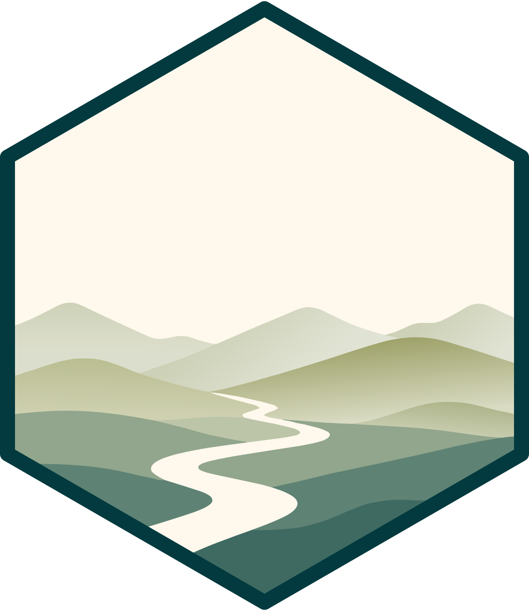

# animovement brand 

*Source of truth for the animovement artwork*

The scripts that generate the package hexes, icon marks, OpenGraph card and
README banner, plus the traced landscape they all derive from.

## Usage

Everything runs through [pixi](https://pixi.sh):

``` sh
pixi run all
```

| task | output |
| --- | --- |
| `packages` | the seven package hexes |
| `rainbow` | `animovement.svg`, the metapackage hex |
| `marks` | icon and square marks |
| `og` | OpenGraph cards, four haze levels |
| `banner` | README banners, three sizes |
| `all` | all of the above |
| `verify <dir>` | diff regenerated artwork against a reference directory |

Nothing is published automatically. Copy `out/packages/` into each package's
`man/figures/` and the website's `assets/logos/`; `out/marks/`, `out/og/` and
`out/banner/` into the website's `assets/images/`.

## Layout

```
base/                    inputs, not generated
  animovement-fixed.svg  the traced landscape everything derives from
  fonts/                 Poppins + OFL licence
animovement_brand/       library modules and gen_* entry points
out/                     generated artwork (gitignored)
```

| module | what it does |
| --- | --- |
| `lab` | sRGB ↔ CIELAB ↔ LCh, strict gamut testing, `max_chroma`, `vivid` |
| `palette` | MetBrewer Cross + substitutions, monochrome ramp builder |
| `typeset` | font → SVG outline paths, so artwork carries no font dependency |
| `waves` | wave bands, gaussian haze, id namespacing |
| `geometry` | regular pointy-top hexagon, keyline border |
| `fitcurve` | Schneider least-squares cubic Bézier fitting |

Poppins is vendored in `base/fonts/`, so a fresh checkout renders type without
installing anything. Paths resolve from the repository root; set
`ANIMOVEMENT_FONT_DIR` to override.

## Details

### Provenance

**The scripts are a reconstruction.** The working container was reset and the
originals were lost. They have been re-run and check out against the delivered
artwork, but treat them as freshly written code. That loss is why they are
versioned here.

`base/animovement-fixed.svg` **cannot be regenerated.** It came from
vector-tracing the original raster logo, and that pipeline was not recovered.
Everything else can be rebuilt from it.

### Colour rules

**Gamut testing must be strict.** `lab2rgb` clips internally, so a naive round
trip reports every colour as in-gamut and chroma ceilings come back meaningless.
`ingamut_strict` checks the unclipped values.

**Chroma ceilings vary hugely by hue.** At L\* 60 green reaches C\* 77 but teal
only 35.7. Setting chroma as a fraction of each hue's own ceiling keeps a set
looking evenly vivid; one absolute value leaves teals dull and clips oranges.

**Lightness caps chroma.** Above roughly L\* 85 no hue holds much saturation, so
the landscape's lightness is compressed into 45–80 first.

**The metapackage has two chroma rules, not one.** `gen_rainbow` caps landscape
and wordmark at C\* 62 — a fraction-of-ceiling rule makes green shout, reading
as a lime stripe — but leaves the border uncapped so it stays brighter than the
artwork it frames. It also applies the rainbow over the deepteal-ramped hex
rather than the raw base, because that is the chain the shipped file came
through; skipping it shifts a few values by 1/255.

### Drawing rules

**Namespace every id.** Inlining several SVGs into one document makes every
`url(#gradient119)` resolve to the first definition found — this silently turned
all eight package gradients magenta. `waves.namespace()` prefixes ids and
references.

**Centre type on ink bounds, not the baseline.** The dot on the `i` extends the
ink box upward; centring by eye left the 512px marks 33px high.

**A linear haze ramp clamps.** Once pad + feather reaches the edge, more feather
does nothing. `waves.gaussian_haze` feathers all the way out.

**Booleans need closed, stroked-to-path shapes.** Inkscape's Intersection works
on fill areas; open paths get implicitly closed with a straight segment.

### Verification

`pixi run verify <dir>` rasterises each SVG under `out/` and its same-named
counterpart in `<dir>`, through the same renderer, and reports the pixel
difference. Files with no counterpart are listed rather than skipped.

Against the logos shipped on the website all eight hexes come out at max diff 0.
They differ slightly as text — the package hexes by 28 bytes, from a gradient id
named `keyline` rather than `rbline` and an extra `inkscape:label`;
`animovement.svg` by 13, purely from how `ElementTree` spaces self-closing tags.
The path geometry is byte-identical and neither difference renders.

The marks, OG cards and banners ship under different filenames, so they show as
unmatched until `verify` is pointed at their directories.

### Not included

Contact-sheet and comparison-image builders, and the superseded design
explorations: the hue-rotation palette, the fade/haze hex studies, the six
border treatments, and the horizontal-wave marks.

The raster-tracing pipeline behind `base/animovement-fixed.svg`. It is
reconstructible from the session transcript, but the traced SVG exists, so it
should not be needed.
